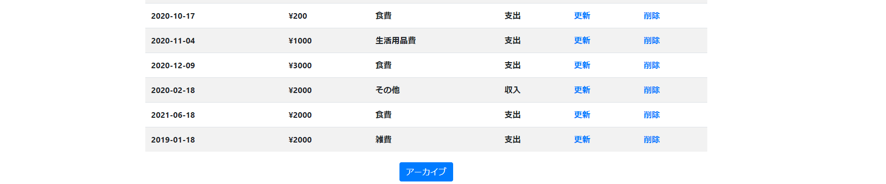
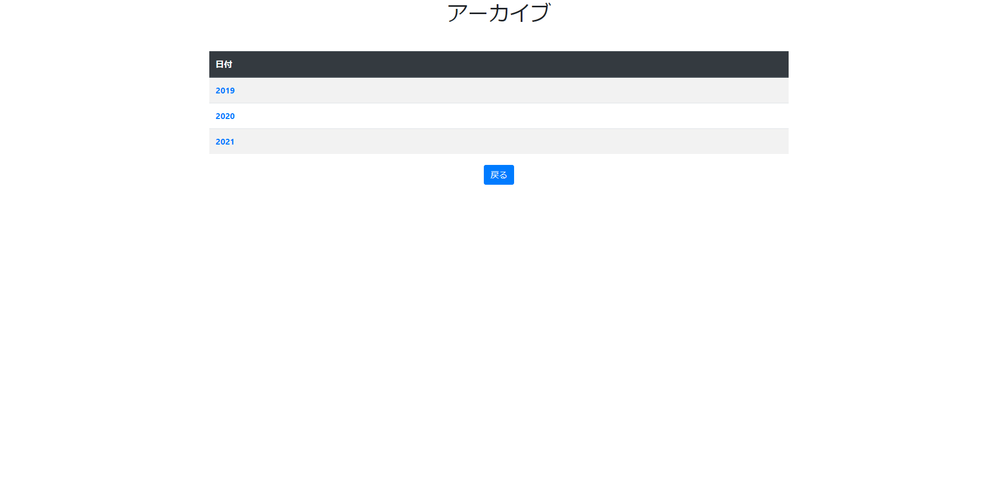

# 家計簿アプリ
DB接続がある家計簿アプリを作成しました  
## テーブル構造
テーブル名:savings  
id saving summary date  
  
## 概要
テーブルを日付、支出、概要で表示します。
テーブルは更新・削除・追加できるようにしました。

  
テーブル内容を価格が安い順か日付が早い順に並び変えられるようにしました  
  
  
  
# 追加  
表の下にアーカイブへ遷移するボタンを作りました  
  
これを押すと年ごとに表が分かれて表示されます  
  
それぞれの年はクリックできるようになっています。  
クリックするとその年の収支のグラフと表が表示されます。  
  
 

